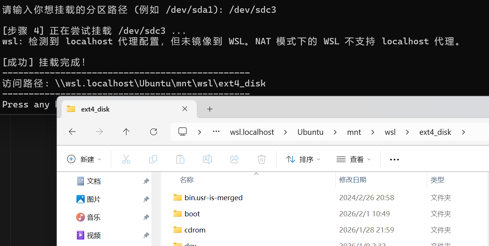

  在Linux桌面端， 挂载**NTFS格式**的磁盘非常轻松，并且你可以通过GUI化的资源管理器和磁盘交互。

  然而Windows上却并没有这项功能，因此我做了[WinMountExt4](https://github.com/CharliiKo/WinMountExt4)小项目。👻

  现在，你可以轻松地利用`MountExt4.bat`和`UnmountExt4.bat`这两个脚本达到和Linux桌面端一样的效果！

  

  本项目基于Microsoft的**WSL2**实现，因此你需要预先安装一个**WSL2的Linux发行版**，具体请参考[Windows安装WSL2-Microsoft](https://www.bing.com/search?q=wsl2)。

  感谢查看🧸。
  
  